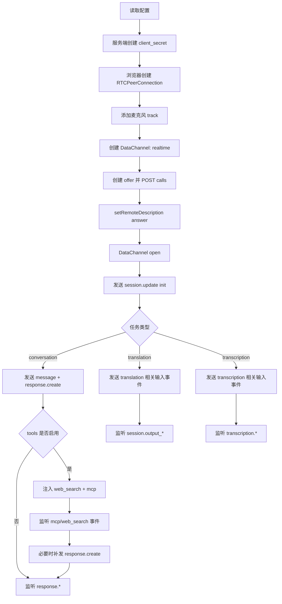

# Realtime 开发指南 - WebRTC

本文是 WebRTC 专篇，重点讲 `client_secrets`、`calls`、DataChannel init 包、VAD 配置，以及 MCP/Web Search 工具如何并入会话。

覆盖模型：

- `gpt-realtime-2`（conversation）
- `gpt-realtime-translate` / `gpt-realtime-translation`（translation）
- `gpt-realtime-whisper`（transcription）

## 1. 流程图



## 2. 节点逐步实现

### 节点 A：读取配置

```javascript
const endpoint = process.env.RT_ENDPOINT;
const model = process.env.RT_MODEL || 'gpt-realtime-2';
const task = process.env.RT_TASK || 'conversation';
const authMode = process.env.RT_AUTH_MODE || 'api-key';
```

### 节点 B：服务端创建 client_secret

conversation/transcription：

```http
POST https://<resource>.openai.azure.com/openai/v1/realtime/client_secrets
```

translation：

```http
POST https://<resource>.openai.azure.com/openai/v1/realtime/translations/client_secrets
```

请求体（conversation 示例）：

```json
{
  "session": {
    "type": "realtime",
    "model": "gpt-realtime-2",
    "audio": { "output": { "voice": "alloy" } }
  }
}
```

### 节点 C/D/E：创建 PC、音轨、DataChannel

```javascript
const pc = new RTCPeerConnection();
const dc = pc.createDataChannel('realtime');

const stream = await navigator.mediaDevices.getUserMedia({ audio: true });
for (const track of stream.getAudioTracks()) pc.addTrack(track, stream);
```

### 节点 F/G：calls 握手

conversation/transcription calls：

```text
POST https://<resource>.openai.azure.com/openai/v1/realtime/calls
```

translation calls：

```text
POST https://<resource>.openai.azure.com/openai/v1/realtime/translations/calls
```

代码：

```javascript
const offer = await pc.createOffer();
await pc.setLocalDescription(offer);

const resp = await fetch(callsUrl, {
  method: 'POST',
  headers: {
    Authorization: `Bearer ${clientSecret}`,
    'Content-Type': 'application/sdp'
  },
  body: offer.sdp
});

const answerSdp = await resp.text();
await pc.setRemoteDescription({ type: 'answer', sdp: answerSdp });
```

### 节点 H/I：DataChannel open 后 init 包

conversation init：

```json
{
  "type": "session.update",
  "session": {
    "type": "realtime",
    "model": "gpt-realtime-2",
    "instructions": "你是简洁助手。",
    "audio": { "output": { "voice": "alloy" } }
  }
}
```

translation init：

```json
{
  "type": "session.update",
  "session": {
    "audio": {
      "output": { "language": "en" },
      "input": { "transcription": { "model": "gpt-realtime-whisper" } }
    }
  }
}
```

transcription init：

```json
{
  "type": "session.update",
  "session": {
    "type": "transcription",
    "audio": {
      "input": {
        "format": { "type": "audio/pcm", "rate": 24000 },
        "transcription": { "model": "gpt-realtime-whisper" },
        "turn_detection": null
      }
    }
  }
}
```

### 节点 J/K/L/M：按任务发输入

conversation 文本：

```javascript
dc.send(JSON.stringify({
  type: 'conversation.item.create',
  item: {
    type: 'message',
    role: 'user',
    content: [{ type: 'input_text', text: '你好' }]
  }
}));
dc.send(JSON.stringify({ type: 'response.create', response: {} }));
```

translation/transcription 语音输入：

- WebRTC 音轨会持续上传麦克风音频。
- 控制类事件仍通过 DataChannel 发送。

### 节点 N/O/P/Q：MCP + Web Search 工具接入

conversation 才建议启用工具：

```javascript
const tools = [];
if (enableWebSearch) tools.push({ type: 'web_search' });
if (enableMcp) {
  tools.push({
    type: 'mcp',
    server_url: mcpServerUrl,
    headers: { Authorization: `Bearer ${mcpToken}` }
  });
}

dc.send(JSON.stringify({
  type: 'session.update',
  session: { type: 'realtime', model, tools, tool_choice: 'auto' }
}));
```

事件处理：

```javascript
dc.addEventListener('message', (ev) => {
  const msg = JSON.parse(ev.data);
  if (msg.type === 'response.mcp_call.in_progress') console.log('MCP calling');
  if (msg.type === 'response.mcp_call.completed') console.log('MCP done');
  if (msg.type === 'response.output_text.delta') process.stdout.write(msg.delta || '');
  if (msg.type === 'response.done') process.stdout.write('\n');
});
```

工具结果后补发最终回答：

```javascript
dc.send(JSON.stringify({
  type: 'response.create',
  response: {
    tool_choice: 'none',
    instructions: '请基于工具结果直接回答。'
  }
}));
```

### 节点 R/S/T：输出事件

| 任务 | 重点事件 |
| --- | --- |
| conversation | `response.output_text.delta` / `response.done` |
| translation | `session.output_transcript.delta` / `session.output_audio.delta` |
| transcription | `transcription.delta` / `transcription.completed` |

## 3. VAD（WebRTC 场景）

### 手动提交模式

- `turn_detection: null`
- 由应用层控制一句话何时结束

### 服务器 VAD 模式（conversation）

```json
{
  "type": "session.update",
  "session": {
    "type": "realtime",
    "audio": {
      "input": {
        "turn_detection": {
          "type": "server_vad",
          "threshold": 0.5,
          "silence_duration_ms": 600
        }
      }
    }
  }
}
```

如果模型/API 报 `unknown_parameter`，回退为手动提交模式。

## 4. 开发顺序建议

1. 先做 conversation（无工具）
2. 再打开 web_search
3. 再接 MCP
4. 最后接 translation 和 transcription

这样最容易定位每一步的故障边界。
