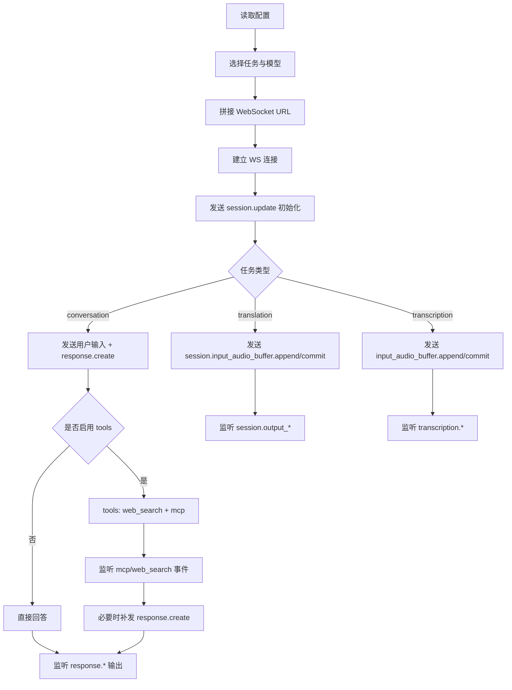

# Realtime 开发指南 - WebSocket

本文是 WebSocket 专篇，目标是让开发者按步骤实现可运行的基础程序，并能接入 `web_search` 与 MCP 工具。

覆盖模型：

- `gpt-realtime-2`（conversation）
- `gpt-realtime-translate`（translation）
- `gpt-realtime-whisper`（transcription）

## 1. 流程图



## 2. 节点逐步实现

### 节点 A：读取配置

必需参数：

| 参数 | 示例 |
| --- | --- |
| `RT_ENDPOINT` | `https://YOUR-RESOURCE.openai.azure.com` |
| `RT_AUTH_MODE` | `api-key` / `managed-identity` |
| `OPENAI_API_KEY` | `...` |
| `RT_API_VERSION` | `2025-04-01-preview` |

示例：

```javascript
const endpoint = process.env.RT_ENDPOINT;
const authMode = process.env.RT_AUTH_MODE || 'api-key';
const apiKey = process.env.OPENAI_API_KEY;
const apiVersion = process.env.RT_API_VERSION || '2025-04-01-preview';
```

### 节点 B：选择任务与模型

推荐映射：

| 任务 | 模型 |
| --- | --- |
| `conversation` | `gpt-realtime-2` |
| `translation` | `gpt-realtime-translate` |
| `transcription` | `gpt-realtime-whisper` |

```javascript
const task = process.argv[2] || 'conversation';
const modelMap = {
  conversation: 'gpt-realtime-2',
  translation: 'gpt-realtime-translate',
  transcription: 'gpt-realtime-whisper'
};
const model = process.env.RT_MODEL || modelMap[task];
```

### 节点 C：拼接 WebSocket URL

```javascript
function buildWsUrl({ endpoint, model, task, apiVersion, useV1 = true }) {
  const base = endpoint.replace('https://', 'wss://').replace(/\/$/, '');
  if (task === 'translation') {
    return `${base}/openai/v1/realtime/translations?model=${encodeURIComponent(model)}`;
  }
  if (useV1 || task !== 'conversation') {
    return `${base}/openai/v1/realtime?model=${encodeURIComponent(model)}`;
  }
  return `${base}/openai/realtime?api-version=${encodeURIComponent(apiVersion)}&deployment=${encodeURIComponent(model)}`;
}
```

### 节点 D：建立 WS 连接

```javascript
import WebSocket from 'ws';

const ws = new WebSocket(wsUrl, ['realtime'], {
  headers: authMode === 'api-key'
    ? { 'api-key': apiKey }
    : { Authorization: `Bearer ${process.env.RT_BEARER_TOKEN}` }
});
```

### 节点 E：发送 session.update 初始化

conversation init：

```json
{
  "type": "session.update",
  "session": {
    "type": "realtime",
    "model": "gpt-realtime-2",
    "instructions": "你是一个简洁助手。",
    "audio": { "output": { "voice": "alloy" } }
  }
}
```

translation init：

```json
{
  "type": "session.update",
  "session": {
    "audio": {
      "output": { "language": "en" },
      "input": { "transcription": { "model": "gpt-realtime-whisper" } }
    }
  }
}
```

翻译 session 只需要声明目标语言 `audio.output.language`。`audio.input.transcription` 只用于让服务额外返回源语言字幕；OpenAI 文档没有要求声明源语言，Azure Realtime translations 当前还会拒绝 `session.audio.input.transcription.language`，因此不要在 Azure 翻译 payload 中发送该字段。

transcription init：

```json
{
  "type": "session.update",
  "session": {
    "type": "transcription",
    "audio": {
      "input": {
        "format": { "type": "audio/pcm", "rate": 24000 },
        "transcription": { "model": "gpt-realtime-whisper" },
        "turn_detection": null
      }
    }
  }
}
```

转写 session 可以声明 `audio.input.transcription.language` 作为可选语言提示，例如 `{ "model": "gpt-realtime-whisper", "language": "zh" }`。这是 hint，不是必填项；只在目标端点确认支持时发送。

### 节点 F/G/H/I：按任务发送输入

conversation 文本输入：

```javascript
ws.send(JSON.stringify({
  type: 'conversation.item.create',
  item: {
    type: 'message',
    role: 'user',
    content: [{ type: 'input_text', text: '你好，介绍一下今天的计划' }]
  }
}));

ws.send(JSON.stringify({ type: 'response.create', response: {} }));
```

translation 音频输入：

```javascript
ws.send(JSON.stringify({ type: 'session.input_audio_buffer.append', audio: '<base64 pcm16>' }));
ws.send(JSON.stringify({ type: 'session.input_audio_buffer.commit' }));
```

transcription 音频输入：

```javascript
ws.send(JSON.stringify({ type: 'input_audio_buffer.append', audio: '<base64 pcm16>' }));
ws.send(JSON.stringify({ type: 'input_audio_buffer.commit' }));
```

### 节点 J/K/M/N：MCP + Web Search 工具链

工具初始化：

```javascript
const tools = [];
if (enableWebSearch) tools.push({ type: 'web_search' });
if (enableMcp) {
  tools.push({
    type: 'mcp',
    server_url: mcpServerUrl,
    headers: { Authorization: `Bearer ${mcpToken}` }
  });
}

ws.send(JSON.stringify({
  type: 'session.update',
  session: {
    type: 'realtime',
    model,
    tools,
    tool_choice: 'auto',
    instructions: '天气和地图问题优先调用工具。'
  }
}));
```

关键事件监听：

```javascript
ws.on('message', (buf) => {
  const msg = JSON.parse(buf.toString());
  if (msg.type === 'mcp_list_tools.completed') console.log('MCP tools loaded');
  if (msg.type === 'response.mcp_call.in_progress') console.log('MCP call in progress');
  if (msg.type === 'response.mcp_call.completed') console.log('MCP call completed');
  if (msg.type === 'response.output_text.delta' && msg.delta) process.stdout.write(msg.delta);
  if (msg.type === 'response.done') process.stdout.write('\n');
});
```

工具调用后补发最终回答：

```javascript
ws.send(JSON.stringify({
  type: 'response.create',
  response: {
    tool_choice: 'none',
    instructions: '请基于工具结果直接给结论，不要再次调用工具。'
  }
}));
```

### 节点 O/P/Q：输出事件处理

| 任务 | 重点事件 |
| --- | --- |
| conversation | `response.output_text.delta` / `response.output_audio.delta` / `response.done` |
| translation | `session.output_transcript.delta` / `session.output_audio.delta` |
| transcription | `transcription.delta` / `transcription.completed` |

## 3. VAD（WebSocket 场景）

conversation 可选服务器 VAD：

```json
{
  "type": "session.update",
  "session": {
    "type": "realtime",
    "audio": {
      "input": {
        "turn_detection": {
          "type": "server_vad",
          "threshold": 0.5,
          "silence_duration_ms": 600
        }
      }
    }
  }
}
```

若报 `unknown_parameter`，先回退：`turn_detection: null` + 手动 `commit`。

## 4. 最小可运行脚本建议

建议先写三个脚本：

1. `examples/ws-conversation.js`
2. `examples/ws-translation.js`
3. `examples/ws-transcription.js`

先跑通 `conversation`，再扩展 translation/transcription。
