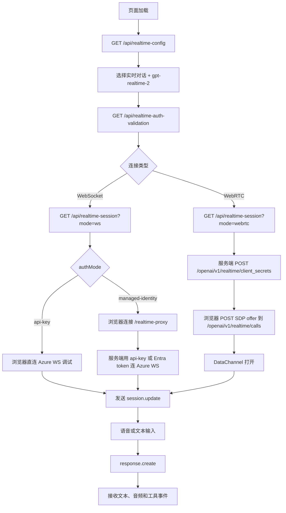

# gpt-realtime-2 WebSocket/WebRTC 连接配置

本文说明本项目中 `gpt-realtime-2` 实时对话模型的 WebSocket 和 WebRTC 连接配置，包括 endpoint、后端 API、上游路径、请求参数和调用流程。

适用范围：实时对话任务，也就是前端任务类型选择“实时对话”且模型选择 `gpt-realtime-2`。实时转写和实时翻译使用不同 session 类型与路径，不属于本文范围。

## 本地配置

`gpt-realtime-2` 在本项目中作为对话模型使用。Azure 配置示例：

```json
{
  "realtime": {
    "provider": "azure",
    "authMode": "api-key",
    "apiKey": "",
    "apiKeyEnv": "OPENAI_API_KEY",
    "endpoint": "https://YOUR-RESOURCE.openai.azure.com",
    "api_version": "2025-04-01-preview",
    "use_v1_path": true,
    "model": "gpt-realtime-2",
    "deployment": "gpt-realtime-2",
    "voice": "alloy"
  }
}
```

关键字段：

- `endpoint`：Azure OpenAI 资源根地址，不要包含 `/openai/...` 路径。
- `model` / `deployment`：本项目会把它们当作部署名使用；Azure 上应填实际部署名。若部署名就是 `gpt-realtime-2`，两者都填这个值最直观。
- `use_v1_path`：建议实时对话优先使用 `true`，走 GA v1 路径；必要时前端可取消“使用 GA v1 路径”回退 preview WebSocket。
- `api_version`：主要用于 preview 路径和配置展示；GA v1 WebSocket 不依赖该查询参数。
- `authMode`：`api-key` 适合本地调试；`managed-identity` 适合 Azure 环境，WebSocket 会自动走本地代理。
- `apiKey` / `apiKeyEnv`：推荐把真实 key 放到环境变量，并用 `apiKeyEnv` 指向变量名；仅本地调试时可把 key 直接写入被忽略的 `config/config.json`。
- `voice`：实时对话音色，例如 `alloy`、`ash`、`ballad`、`coral`、`echo`、`sage`、`shimmer`、`verse`。

等价环境变量覆盖：

```bash
export RT_PROVIDER=azure
export RT_ENDPOINT="https://YOUR-RESOURCE.openai.azure.com"
export RT_MODEL=gpt-realtime-2
export RT_DEPLOYMENT=gpt-realtime-2
export RT_AUTH_MODE=api-key
export OPENAI_API_KEY="..."
```

如果使用 managed identity：

```bash
export RT_AUTH_MODE=managed-identity
export RT_AZURE_CLIENT_ID="..." # 用户分配托管身份时才需要
export RT_AZURE_AUTH_SCOPE="https://cognitiveservices.azure.com/.default"
```

## 本项目后端 API

前端不会直接拼所有上游参数，而是先调用本地后端获取安全配置和连接元数据。

| API | 用途 | 关键参数 |
| --- | --- | --- |
| `GET /api/realtime-config` | 返回安全配置，不包含长期密钥 | 无 |
| `GET /api/realtime-auth-validation` | 连接前校验 API key 或 managed identity | 无 |
| `GET /api/realtime-session` | 创建或描述实时连接会话 | `mode`、`task`、`model`、`voice`、`use_v1` |
| `GET /api/realtime-ws-key` | 本地调试时返回 WebSocket 直连所需 API key | 仅 `api-key` 模式可用 |
| `WS /realtime-proxy` | 本地 WebSocket 代理 | `model`、`task`、`use_v1` |

实时对话的典型 session 请求：

```http
GET /api/realtime-session?mode=ws&use_v1=1&task=conversation&model=gpt-realtime-2&voice=alloy
```

WebRTC 的典型 session 请求：

```http
GET /api/realtime-session?mode=webrtc&use_v1=1&task=conversation&model=gpt-realtime-2&voice=alloy
```

参数含义：

- `mode=ws|webrtc`：决定本地后端返回 WebSocket 元数据，还是向 Azure 创建 WebRTC client secret。
- `task=conversation`：实时对话任务；`gpt-realtime-2` 应使用这个任务类型。
- `model=gpt-realtime-2`：模型/部署名。服务端会校验它是否在允许列表中。
- `voice=alloy`：输出音色，仅实时对话和实时翻译使用。
- `use_v1=1`：使用 GA v1 路径；`0` 表示允许 preview 路径。

## WebSocket 连接

### Azure GA v1 路径

当 `use_v1=1` 时，上游 WebSocket URL 为：

```text
wss://YOUR-RESOURCE.openai.azure.com/openai/v1/realtime?model=gpt-realtime-2
```

认证方式：

- 服务端代理或 Node.js 上游连接：`api-key: <key>` 或 `Authorization: Bearer <token>` 请求头。
- 浏览器直连调试：本项目会从 `/api/realtime-ws-key` 获取 API key，并把它追加到连接 URL 查询参数。生产环境不要使用这种方式。
- managed identity：浏览器连接本地 `/realtime-proxy`，由服务端用 Entra token 连接 Azure，上游不会把 bearer token 暴露给浏览器。

本地代理 URL：

```text
ws://localhost:3000/realtime-proxy?model=gpt-realtime-2&use_v1=1&task=conversation
```

代理再连接 Azure GA 上游：

```text
wss://YOUR-RESOURCE.openai.azure.com/openai/v1/realtime?model=gpt-realtime-2
```

### Azure preview 回退路径

当 `use_v1=0` 或 GA WebSocket 长时间无响应并触发前端回退时，上游 WebSocket URL 为：

```text
wss://YOUR-RESOURCE.openai.azure.com/openai/realtime?api-version=2025-04-01-preview&deployment=gpt-realtime-2
```

preview 路径会发送 `OpenAI-Beta: realtime=v1` 请求头。当前项目在 Azure preview WebSocket 下不会发送 hosted tools，避免工具字段兼容性问题。

### WebSocket session.update

WebSocket 打开后，前端会发送 `session.update`。GA v1 对话路径的核心 payload：

```json
{
  "type": "session.update",
  "session": {
    "type": "realtime",
    "model": "gpt-realtime-2",
    "audio": {
      "output": {
        "voice": "alloy"
      }
    },
    "instructions": "...",
    "max_response_output_tokens": 400,
    "tools": [],
    "tool_choice": "auto"
  }
}
```

说明：

- `type="realtime"` 表示实时对话 session。
- `model` 使用前端下拉选中的 `gpt-realtime-2`。
- `audio.output.voice` 控制语音输出音色。
- `instructions` 由 `system_prompt`、`speech_style_instructions` 和工具使用规则合并生成。
- `tools` 仅在实时对话任务中发送，可包含 `web_search` 和 `mcp`。
- 没有启用工具时，前端仍可发送空数组或省略工具字段；服务端创建 client secret 时会省略空工具。

文本输入流程：

```json
{
  "type": "conversation.item.create",
  "item": {
    "type": "message",
    "role": "user",
    "content": [
      { "type": "input_text", "text": "你好，帮我查一下今天的天气" }
    ]
  }
}
```

随后发送：

```json
{
  "type": "response.create",
  "response": {}
}
```

语音输入在 WebSocket 路径下由浏览器采集 PCM 后通过实时事件流发送；服务端事件会返回 `response.output_audio.delta` / `response.output_audio_transcript.delta` / `response.output_text.delta` 等输出事件。

## WebRTC 连接

WebRTC 路径适合浏览器实时语音，音频走 RTP track，控制事件走 DataChannel。

### 创建 client secret

前端先请求本地后端：

```http
GET /api/realtime-session?mode=webrtc&use_v1=1&task=conversation&model=gpt-realtime-2&voice=alloy
```

Azure GA 上游请求：

```http
POST https://YOUR-RESOURCE.openai.azure.com/openai/v1/realtime/client_secrets
Content-Type: application/json
api-key: <key>
```

或 managed identity：

```http
Authorization: Bearer <token>
```

请求体核心结构：

```json
{
  "session": {
    "type": "realtime",
    "model": "gpt-realtime-2",
    "instructions": "...",
    "audio": {
      "output": {
        "voice": "alloy"
      }
    },
    "tools": [],
    "tool_choice": "auto"
  }
}
```

后端返回值会规范化为：

```json
{
  "client_secret": {
    "value": "..."
  },
  "endpoint": "https://YOUR-RESOURCE.openai.azure.com",
  "deployment": "gpt-realtime-2",
  "model": "gpt-realtime-2",
  "task": "conversation",
  "path_variant": "ga"
}
```

### 发送 SDP offer

浏览器创建 `RTCPeerConnection`，添加麦克风音轨，创建名为 `realtime` 的 DataChannel，然后把 SDP offer 发到：

```text
https://YOUR-RESOURCE.openai.azure.com/openai/v1/realtime/calls
```

请求头：

```http
Authorization: Bearer <client_secret.value>
Content-Type: application/sdp
```

请求体是 `pc.localDescription.sdp`。服务返回 SDP answer 后，浏览器调用 `pc.setRemoteDescription({ type: "answer", sdp })` 完成连接。

DataChannel 打开后，前端会发送与 WebSocket 类似的 `session.update`。WebRTC 音频输入不需要手动编码成 `input_audio_buffer.append`，麦克风音轨会通过 WebRTC RTP 发送。输出音频通过远端 audio track 播放，因此 WebRTC 模式下不一定出现 WebSocket 那种 `response.output_audio.delta` 音频片段事件。

## 端到端流程图



## 常见问题

- `Invalid realtime model/deployment`：确认 `model` 或 `deployment` 是允许列表中的 `gpt-realtime-2`，或把实际部署名写入配置后重启服务。
- `Missing realtime endpoint`：确认 `endpoint` 是 Azure OpenAI 资源根地址。
- `401/403`：API key、managed identity 权限、Azure RBAC 或模型部署权限不正确。
- WebSocket GA 无响应：前端会尝试 preview 回退；也可以手动取消“使用 GA v1 路径”。
- 工具字段报 `unknown_parameter`：先关闭 native web search/MCP，只保留基础 `session.type`、`model`、`audio.output.voice` 和 `instructions` 验证连接。
- WebRTC 没有音频 delta：这是正常的，WebRTC 音频通过远端 media track 播放，不依赖 `response.output_audio.delta`。