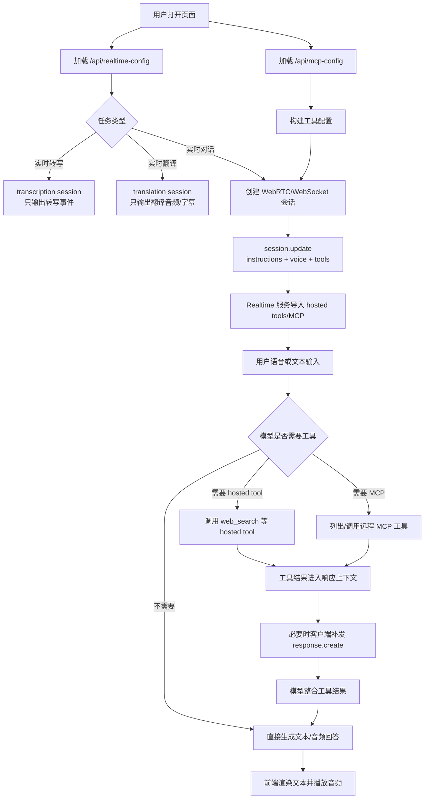

# Realtime 工具与 MCP 调用流程

本文说明本项目中 Realtime 系列模型如何加载 hosted tools 和远程 MCP 工具、模型如何决定调用工具，以及适合语音实时场景的 prompt 实践。

适用范围：实时对话任务。实时转写只输出转写文本，实时翻译使用独立 `/realtime/translations` 会话连续翻译音频，这两类任务不走普通 conversation/response 生命周期，也不调用工具。如果翻译或转写结果需要工具增强，应在应用层把结果交给实时对话或普通 Responses/Chat 流程继续处理。

## 调用链概览

1. 浏览器从 `/api/realtime-config` 读取安全配置，从 `/api/mcp-config` 读取 MCP 配置摘要。
2. 用户选择实时对话、模型、音色、连接方式和工具开关。
3. 前端连接 WebRTC 或 WebSocket；Azure managed identity 和翻译 WebSocket 会通过本地 `/realtime-proxy` 走服务端代理。
4. 前端发送 `session.update`，其中包含：
   - `session.type="realtime"`
   - `session.instructions`
   - `session.audio.output.voice`
   - `session.tools`
   - `session.tool_choice="auto"`
5. Realtime 服务根据工具定义导入 hosted tools 或远程 MCP 工具列表。
6. 用户输入语音或文本后，模型在生成回答时决定是否调用工具。
7. 工具调用完成后，服务端事件流会返回工具进度、参数、结果和最终回答事件。当前前端会记录 MCP 生命周期事件，并在 MCP 结果返回后补发一次 `response.create`，触发模型整合工具结果生成最终答复。

## 流程图

## hosted tools 与 MCP 的差异

| 类型 | 典型用途 | 配置位置 | 备注 |
| --- | --- | --- | --- |
| hosted tool | Web search 等平台内置工具 | `config/config.json` 的 `realtime.web_search` 和主界面开关 | API/区域支持会变化，遇到 `unknown_parameter` 时先关闭开关 |
| MCP tool | 地图、天气、业务系统、第三方服务 | `config/mcp_config.json` 或 `/mcp.html` | 当前兼容 `servers` 数组、VS Code 风格 `servers` 对象，以及常见 `mcpServers` 对象；Azure Realtime 当前实测需要把 MCP Authorization 放在 `headers.Authorization` |

## Prompt 实践

Realtime 语音模型对 prompt 的结构很敏感。建议使用短标题段落，而不是一整段泛化要求。本项目默认 prompt 参考 Realtime prompting guide，拆成以下部分：

- `# 角色与目标`：说明助手是低延迟实时语音助手，任务是快速完成问答、查询、排错和工具辅助。
- `# 语言`：语言选择和口音分离。默认简体中文，只有用户明确要求或连续使用另一种语言提出完整请求时才切换语言。
- `# 推理与响应`：直接问题快速回答；复杂问题可以内部理清，但不要描述内部推理。
- `# 简洁度`：直接回答 1-2 个短句，排错一次给一个步骤。
- `# 工具`：只使用当前会话实际提供的工具，实时数据和外部事实应调用工具，缺少参数先追问。
- `# 不清晰音频`：音频模糊时不要猜、不要调用工具，先让用户重复关键内容。
- `# 高精度信息`：订单号、电话、邮箱、地址、金额等在工具调用前复述确认。
- `# 口音与语音风格`：通过 `speech_style_instructions` 单独控制中文普通话韵律，避免和语言切换策略混在一起。

## 工具调用策略

Prompt 中应明确什么时候调用工具，什么时候追问：

- 对天气、地图、路线、地点、网页事实、最新信息，用户意图清楚且参数足够时直接调用工具。
- 城市、地点、时间、目标语言、业务 ID 缺失时，先问一个最关键的问题。
- 读操作可以更积极调用；写操作、下单、取消、支付、发送消息等必须先复述影响并等待确认。
- 工具失败时，不要编造结果；简短说明失败，给出重试或替代方案。
- 不要在 prompt 中提到不存在的工具名；工具名称和 `session.tools` 必须保持同步。

## MCP 事件与前端处理

常见 MCP 相关事件包括：

- `mcp_list_tools.in_progress`
- `mcp_list_tools.completed`
- `mcp_list_tools.failed`
- `response.mcp_call.in_progress`
- `response.mcp_call.arguments.delta`
- `response.mcp_call.arguments.done`
- `response.mcp_call.completed`
- `response.mcp_call.failed`

前端应该把这些事件记录到诊断日志中，方便确认工具是否导入成功、是否被模型选择、参数是否正确、工具是否返回有效结果。

## 调试清单

- 页面连接后查看日志里是否出现“工具已启用”。
- MCP 配置页确认 server URL、label、Authorization 和 allowed tools 正确。
- Azure 路径下，MCP 鉴权优先使用 `headers.Authorization`。
- 如果工具没有被调用，先检查 prompt 是否把工具用途说清楚，再检查工具是否真的在 `session.tools` 中。
- 如果模型拿到工具结果但没有最终回答，确认客户端是否在工具完成后补发了 `response.create`。
- 如果出现 `unknown_parameter`，先缩小 payload，只保留 `session.type`、`instructions`、`audio.output.voice` 和单个工具配置再逐步恢复。
